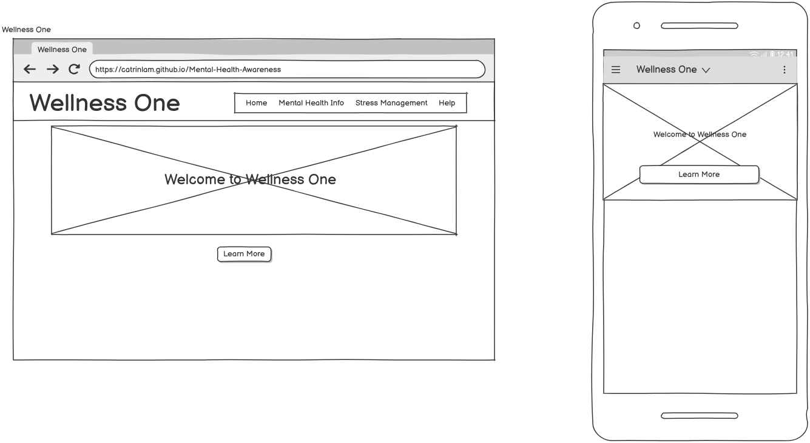
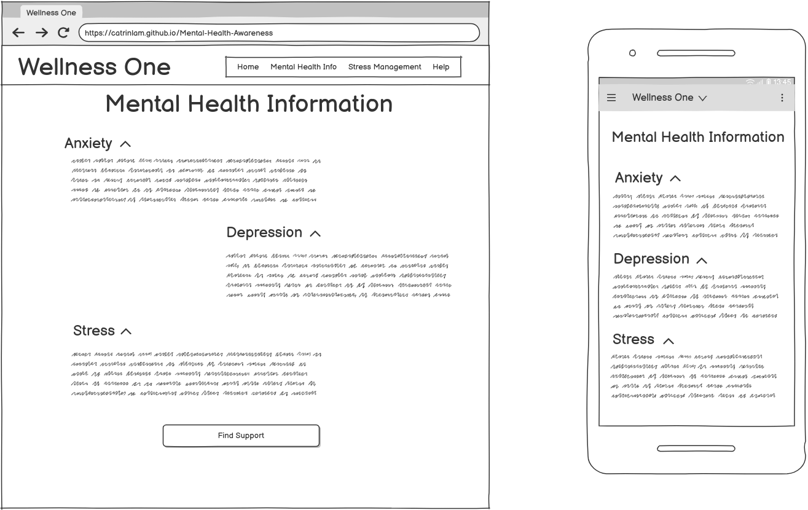
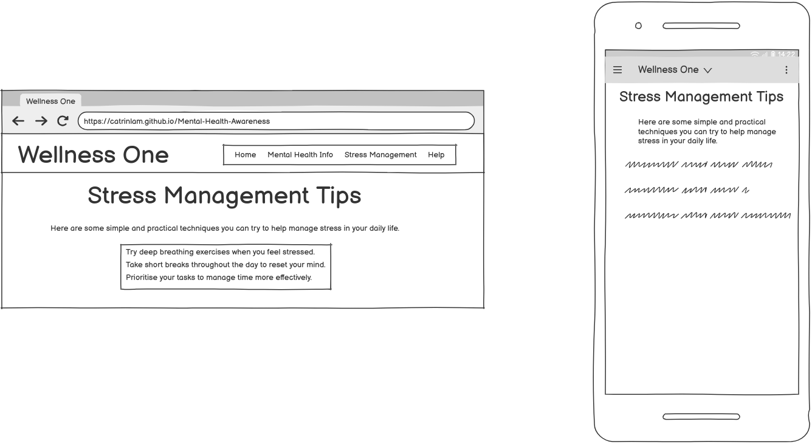
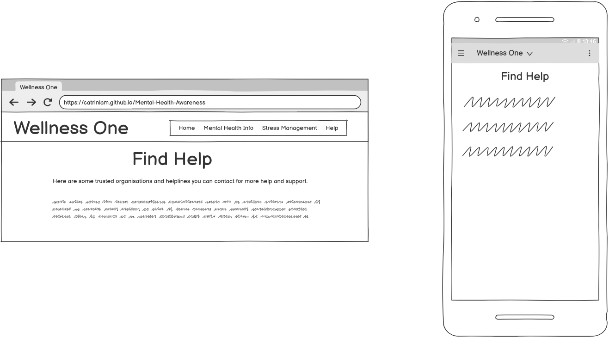
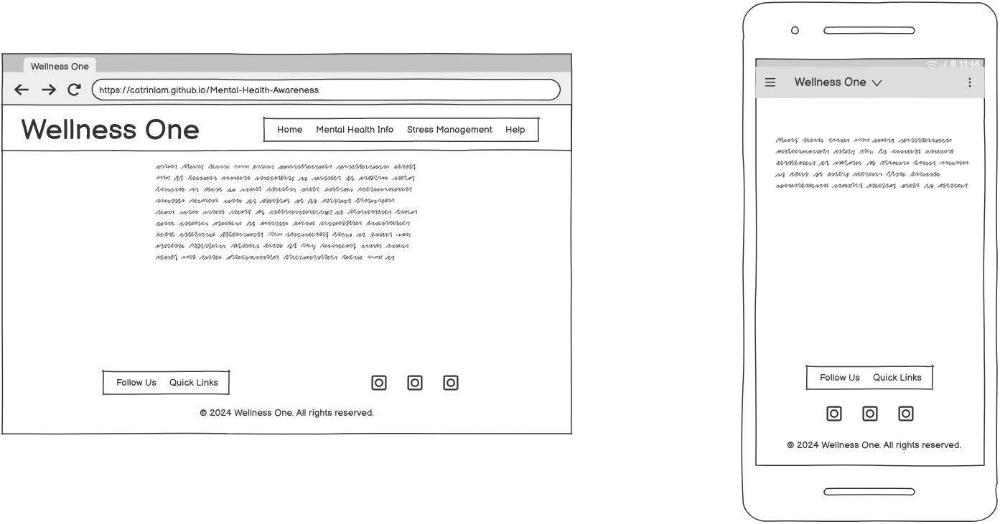

# Wellness One

Wellness One is a one-page website designed to provide easy-to-understand, beginner-friendly information about mental health. The website aims to support users in recognising common mental health challenges and managing stress effectively. With a clean and calming layout, the website ensures an accessible and supportive experience for users seeking quick guidance or resources. Mindful Moments caters to individuals who want to improve their mental well-being and are looking for a starting point on their journey towards mental health awareness.

The site is built with HTML and CSS using the Bootstrap framework, ensuring a responsive and aesthetically pleasing design across all devices. The focus is on delivering a welcoming and organised interface that meets the needs of its audience.

## Site Goals

The primary goals of Wellness One are:

1. **Educational Goal**: To educate users about mental health in a simple and approachable manner.
2. **Support Goal**: To provide practical stress management tips that users can implement immediately.
3. **Connection Goal**: To direct users to professional organisations and resources for further support.

## Design Choices

The design of Wellness One reflects its focus on calmness, simplicity, and accessibility:

- **Minimalist Layout**: A clean, single-page design ensures easy navigation without overwhelming users.
- **Colour Scheme**: Soft, muted colours (light blues, whites, and greens) evoke calmness and positivity.
- **Typography**: Sans-serif fonts are used for readability and to convey a modern, friendly tone.
- **Responsiveness**: The Bootstrap framework ensures compatibility across various devices and screen sizes.

## User Stories
The following user stories were considered to guide the design and functionality of the site:
- As a new user, I want to understand the purpose of the site quickly.
- As a new user, I want to learn about common mental health challenges in an approachable way.
- As a new user, I want to find practical tips to manage my stress immediately.
- As a new user, I want to access links to trusted resources for further help.
- As a new user, I want the site to be easy to navigate, even on my mobile device.
- As a returning user, I want to revisit specific stress management tips that worked for me.
- As a returning user, I want to share helpful content from the site with a friend or loved one.
- As a user, I want to feel supported and reassured by the tone and visuals of the site.

## Wireframes
The wireframes were designed to reflect the simple and structured layout of Wellness One, prioritising usability and accessibility:

1. **Landing Section**:
    - Features a hero image with a calming background, a concise welcome message, and navigation links.
    
2. **Mental Health Information Section**:
    - Divided into easy-to-read subsections covering common challenges like anxiety and depression.
    
3. **Stress Management Section**:
  - Displays practical advice in a bullet point or list format for quick implementation.
  
4. **Resources Section**:
  - Includes external links to trusted organisations and tools.
  
5. **Footer**:
  - Contains social media icons, a contact email, and any disclaimers or additional notes.
  

## Additional UX/UI Considerations

**Accessibility**:
  - Colour contrast and font sizes were tested to ensure readability for users with visual impairments. The chosen colour scheme, shown below, was selected to provide a calming and soothing experience:
  
  - The navigation bar and buttons are large and easy to click, improving usability for individuals with motor impairments.

**User Flow**:
  - A linear, logical layout guides users seamlessly through the site from introduction to actionable resources.

**Feedback Opportunities**:
  - A contact link in the footer encourages users to share feedback for site improvement.

## Features

In this section, you should go over the different parts of your project, and describe each in a sentence or so. You will need to explain what value each of the features provides for the user, focusing on who this website is for, what it is that they want to achieve and how your project is the best way to help them achieve these things.

### Existing Features

- **Navigation Bar**

  - A responsive navigation bar located at the top of the page provides links to all sections: Home, Mental Health Info, Stress Management Tips, and Resources.
  - This section will allow the user to easily navigate from page to page across all devices without having to revert back to the previous page via the ‘back’ button.

- **The landing page image**

  - The landing section includes a soothing background image with an uplifting welcome message, introducing the site's purpose and encouraging users to explore.
  - This feature creates a positive first impression, inviting users to learn more about mental health.

- **Mental Health Information Section**

  - This section outlines common mental health challenges like anxiety and depression, explained in a simple and approachable tone.
  - It provides value by educating users without overwhelming them, making mental health topics more accessible.

- **Stress Management Tips**

  - A concise list of practical stress management techniques, such as breathing exercises and time management tips, is included here.
  - Users gain actionable advice that they can implement immediately to improve their mental well-being.

- **Resources Section**

  - Links to trusted mental health organisations, helplines, and articles are provided in this section.
  - This feature ensures users can easily find further support if needed.

- **The Footer**

  - The footer includes links to the website's social media accounts and an email contact for feedback or additional queries.
  - By encouraging users to connect, this section fosters a sense of community and support.

### Features Left to Implement

- **Interactive Quiz**

  - A short, interactive quiz to help users identify their stress levels and receive personalised tips.

- **Newsletter Sign-Up**
  - A sign-up form to allow users to receive regular updates and mental health tips via email.

## Testing

In this section, you need to convince the assessor that you have conducted enough testing to legitimately believe that the site works well. Essentially, in this part you will want to go over all of your project’s features and ensure that they all work as intended, with the project providing an easy and straightforward way for the users to achieve their goals.

In addition, you should mention in this section how your project looks and works on different browsers and screen sizes.

You should also mention in this section any interesting bugs or problems you discovered during your testing, even if you haven't addressed them yet.

If this section grows too long, you may want to split it off into a separate file and link to it from here.

### Validator Testing

- HTML
  - No errors were returned when passing through the official [W3C validator](https://validator.w3.org/nu/?doc=https%3A%2F%2Fcode-institute-org.github.io%2Flove-running-2.0%2Findex.html)
- CSS
  - No errors were found when passing through the official [(Jigsaw) validator](https://jigsaw.w3.org/css-validator/validator?uri=https%3A%2F%2Fvalidator.w3.org%2Fnu%2F%3Fdoc%3Dhttps%253A%252F%252Fcode-institute-org.github.io%252Flove-running-2.0%252Findex.html&profile=css3svg&usermedium=all&warning=1&vextwarning=&lang=en#css)

### Unfixed Bugs

You will need to mention unfixed bugs and why they were not fixed. This section should include shortcomings of the frameworks or technologies used. Although time can be a big variable to consider, paucity of time and difficulty understanding implementation is not a valid reason to leave bugs unfixed.

## Deployment

- The site was deployed to GitHub pages. The steps to deploy are as follows:
  - In the GitHub repository, navigate to the Settings tab
  - From the source section drop-down menu, select the Deploy Branch
  - Once the Deploy branch has been selected, the page will be automatically refreshed with a detailed ribbon display to indicate the successful deployment.

The live link can be found here - https://code-institute-org.github.io/love-running-2.0/index.html

## Credits

### Content

- Used [Readme Template](https://github.com/Code-Institute-Solutions/readme-template) by Code Institute
- The ReadMe file was rewritten and structured using ChatGPT to ensure clarity and professionalism
- Mental health information adapted from NHS and Mind.org resources.
- The text for the Home page was taken from Wikipedia Article A
- Instructions on how to implement form validation on the Sign Up page was taken from [Specific YouTube Tutorial](https://www.youtube.com/)
- The icons in the footer were taken from [Font Awesome](https://fontawesome.com/)

### Media

- Background image from Unsplash.
